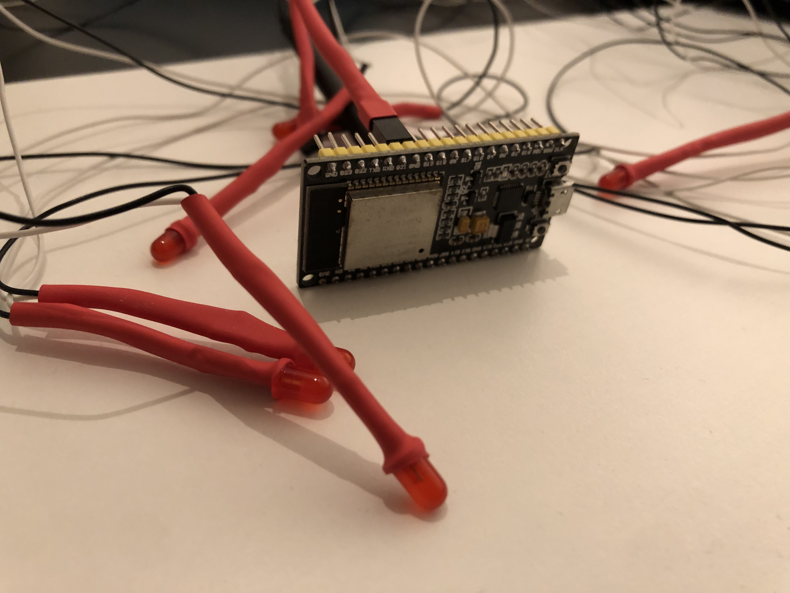

# Esp32 Ping Pong controller
This directory contains the `esp32 / arduino` source files for the LED controllers

- `pingpong_controller.ino`: Main project file to control two LEDs as controller (each with independent frequency) aswell as four leds as corner markers for the playing field
- `blinker.io` : Lets a single led blink with a specified frequency
- `2_led_blinker.in`: Lets two leds blink with independend frequencies

# Hardware
- Single `esp32` microcontroller with 6 red leds
- Each led is connected to its own gpio pin for indivdual control (68 ohm resistor to ground)
- Model connector for easy attaching and detaching
- Heat shrink tubing arround connecter and leds for increased stability
